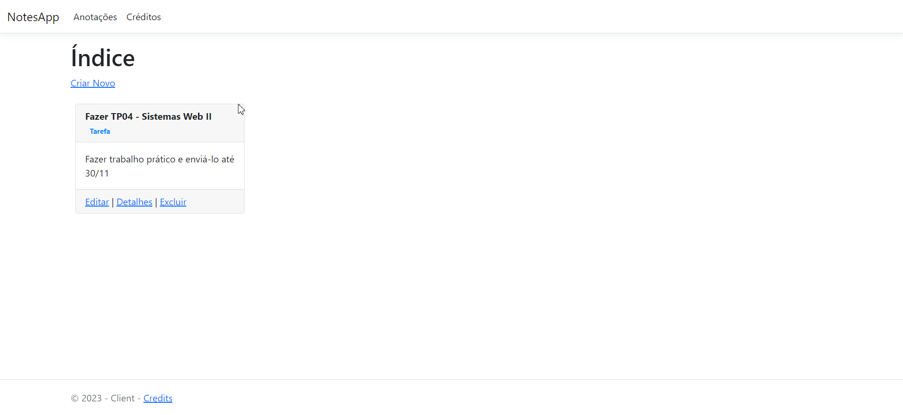
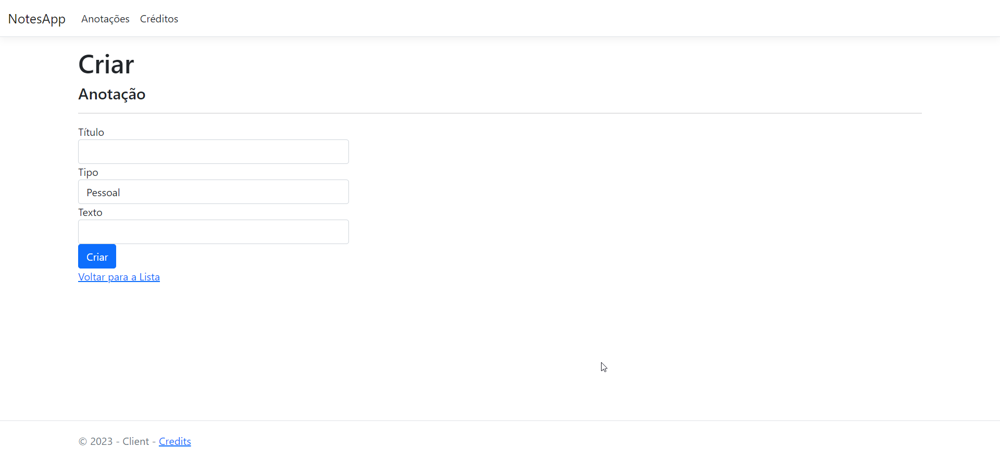
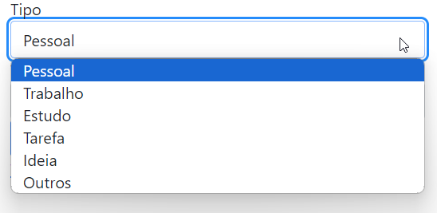
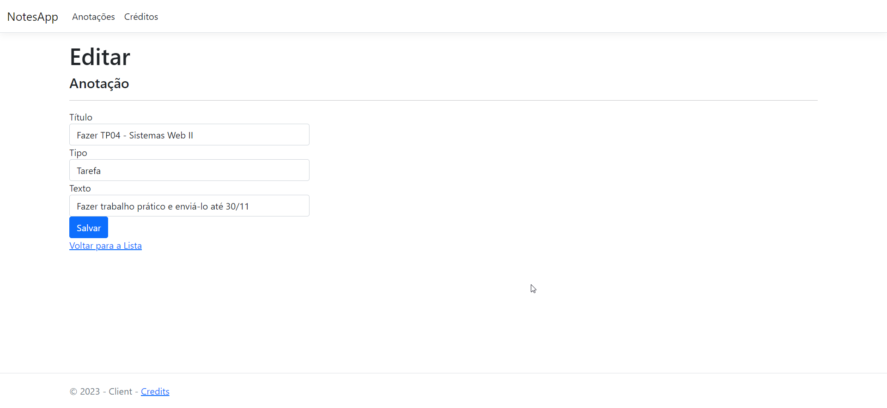
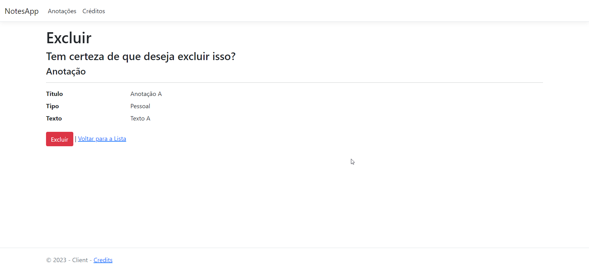
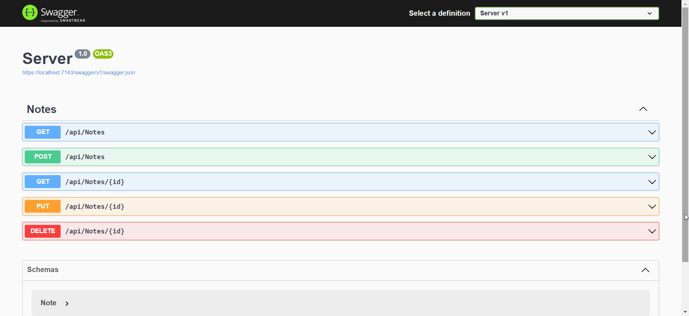

# Documentação da Aplicação

Gif Demonstração

## Introdução

Trabalho prático 04 da disciplina de Sistemas Web II.
Se trata de uma aplicação que permite ao usuário anotar de forma rápida ideias, lembretes, avisos, etc.

## Funcionalidades Principais

### 1. Criação de Anotações

Os usuários podem criar anotações com títulos descritivos, tipos específicos e conteúdo textual.

### 2. Tipos de Anotações

A aplicação permite a categorização de anotações por tipos como "Trabalho", "Pessoal" ou "Ideias".

### 3. Visualização e Edição

Os usuários podem visualizar e editar suas anotações de maneira conveniente.

### 4. Exclusão de Anotações

É possível excluir anotações que não são mais necessárias.

## API Swagger

